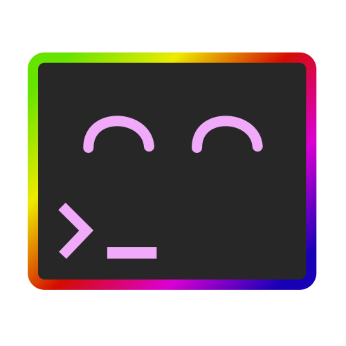
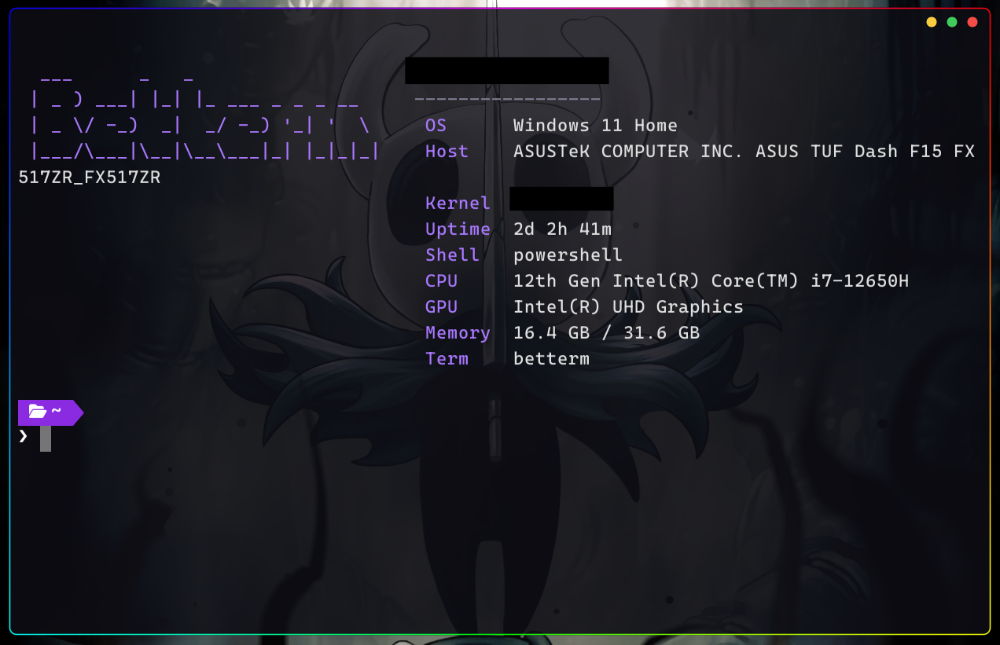

<div align="center">



<h1>betterm</h1>

<p><strong>A small GPU terminal for Windows, written in Rust.</strong></p>

<p>
  <a href="#build--run"></a>
  <a href="https://www.rust-lang.org"></a>
  <a href="https://wgpu.rs"></a>
  <a href="LICENSE"></a>
  
</p>

<p>
It hosts your shell through ConPTY and renders everything itself with <code>wgpu</code>,
so it can do things Windows Terminal can't — animated RGB border, acrylic +
per-pixel transparency on a fully borderless window.
</p>




</div>

## Features

- **Truecolor / 256-color** ANSI rendering (own VT parser on top of `vte`).
- **See-through window**: real per-pixel transparency to the desktop, optional
  wallpaper, and an optional **Windows 11 acrylic** (frosted-glass) backdrop.
- **Animated RGB border** — rounded rainbow ring on a borderless window.
- **System-info banner** at startup (fastfetch style), generated by betterm so it
  works with **any shell** (PowerShell, Git Bash, WSL, …).
- **Themed PowerShell prompt** (violet pwd + pink git branch) auto-loaded without
  touching your global `$PROFILE`.
- **Copy / paste** with `Ctrl+C` / `Ctrl+V` and mouse selection (`Ctrl+C` copies
  the selection if there is one, otherwise sends `SIGINT`).
- **Borderless resize** (drag any edge/corner) and **macOS-style controls**
  (close / minimize / maximize) with drag-to-move from the title bar.

## Build & run

```powershell
cargo build --release
# run from the repo root so it picks up .\betterm.toml
.\target\release\betterm.exe
```

## Configuration

Edit [betterm.toml](betterm.toml). It is looked up in the **current directory**
first, then next to the exe, then `%APPDATA%\betterm\betterm.toml`. All fields are
optional. Highlights:

| Field | Description |
|-------|-------------|
| `font_path`, `font_size`, `line_height` | Font (auto-probes Cascadia/Consolas if unset) |
| `background_image`, `background_opacity`, `background_color` | Wallpaper + see-through tint |
| `acrylic` | Windows 11 frosted-glass backdrop (use with a low opacity) |
| `shell`, `shell_args` | Which shell to launch and its arguments |
| `auto_profile`, `banner` | Inject the themed prompt and show the startup banner |
| `[border]` | RGB border thickness, corner radius, speed, density |

Diagnostics (config loaded, GPU, image decode) are written to
`%LOCALAPPDATA%\betterm\betterm.log` — handy since the GUI has no console.

### Using a different shell

Set `shell` (and leave `shell_args` empty so betterm can inject its prompt +
banner). For Git Bash:

```toml
shell = "C:\\Program Files\\Git\\bin\\bash.exe"
```

Setting `shell_args` yourself overrides the automatic injection.

## How the prompt & banner work

With `auto_profile = true`, betterm injects its own init for known shells without
editing your global profile:

- **PowerShell** — dot-sources [assets/betterm.profile.ps1](assets/betterm.profile.ps1)
  (themed prompt).
- **Git Bash** — launches with [assets/betterm.bashrc](assets/betterm.bashrc),
  which sources your normal profile/bashrc first.

The banner itself is generated by betterm, written to
`%LOCALAPPDATA%\betterm\banner.ans`, and printed by that init — the same content
for every shell. (It can't be drawn into the grid directly because ConPTY
continuously repaints it.)

No special font is required: powerline separators are drawn procedurally and an
embedded Symbols Nerd Font supplies icons your monospace font lacks.

## Notes

- betterm runs on the **GL backend** on purpose: it's the only `wgpu` backend that
  composites a transparent window cleanly on resize on Windows (Vulkan leaves a
  stale rectangle, DX12 ignores per-pixel alpha). The iGPU is plenty for a terminal.

## Architecture

| Module | Responsibility |
|--------|----------------|
| [src/main.rs](src/main.rs) | winit event loop, input, copy/paste, startup |
| [src/pty.rs](src/pty.rs) | ConPTY: launch the shell, read/write, resize |
| [src/terminal.rs](src/terminal.rs) | Cell grid + VT/ANSI parser (`vte::Perform`) |
| [src/font.rs](src/font.rs) | Lazy glyph atlas, nerd-font fallback, powerline separators |
| [src/renderer.rs](src/renderer.rs) | wgpu pipelines: background, cells, glyphs, border |
| [src/banner.rs](src/banner.rs) | System-info banner generation |
| [src/config.rs](src/config.rs) | `betterm.toml` loading |
| [src/shaders/](src/shaders/) | WGSL for quads, glyphs, background, border, circles |

## Known limitations

- No scrollback buffer yet (the visible screen only).
- No ligatures / no separate bold font (bold is faux-brightened).
- Alt-screen apps (vim, etc.) render but reflow on resize is naive.

## License

Licensed under the [MIT License](LICENSE).
